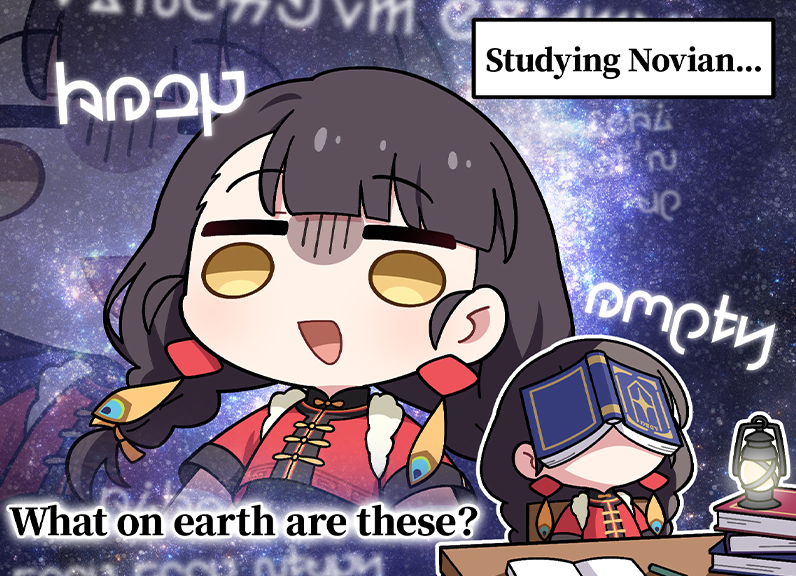

# Novian Alphabet Quiz

  

## **Objective**
Learn the Novian alphabet playing a quiz game! Memorize and translate characters from the game **Stella Sora**.

## **How to Learn**
Don't worry about making mistakes. Start making guesses, even if you don't know the characters. Keep trying until you get the right answer.

## **SRS Size**
Adjusts the learning curve. "Disabled" gives you a standard randomized quiz. Higher levels repeats characters you get wrong more to reinforce your memory. If you're a beginner, we suggest you try the longer levels and adjust while progressing.

## **Quiz Mode & Quiz Type**
**Write:** Use your keyboard to type the matching character.
- **Standard**: Single character challenges
- **Combined**: Three characters challenges

**Select:** Choose the correct answer from three multiple-choice options.
- **Standard**: Translate from Novian
- **Reversed**: Translate to Novian

## **Font Options**
Choose the visual style of the Nova characters you want to study:
- **Print**: Printed Novian characters
- **Cursive**: Cursive Novian characters

## **Learn/Read**
Select which set of characters to learn or read:
- **Lowercase (a-z)**: Learn lowercase characters
- **Uppercase (A-Z)**: Learn uppercase characters
- **Numbers (0-9)**: Learn numeric characters
- **Everything**: Mix of all character types
- **Uppercase ↔ Lowercase**: Learn mapping between cases

## **Reading Practice**
Test your learning progress by reading story snippets from the game. Switch between different character sets to practice reading comprehension.

## **About Stella Sora**
Learn more about **Stella Sora** and its universe:
- [Stella Sora Official Website](https://stellasora.global/)

---
This app was developed with Visual Studio Code and assistance from **GitHub Copilot**.
